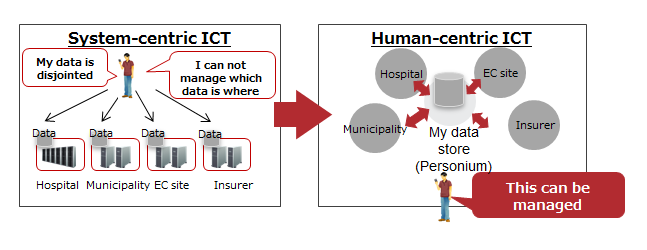
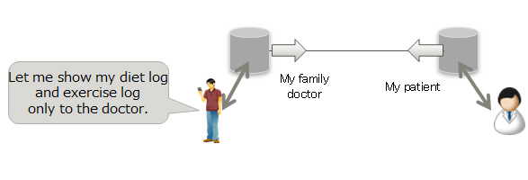
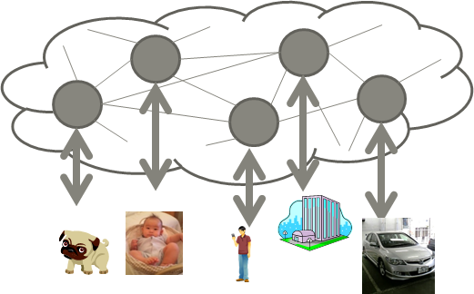

# What is Personium?

Personium is open source PDS (Personal Data Store) server software.

### Anyone can set up a PDS server

Because it is open source software, anyone, business / municipality / government / individual etc, can become a PDS provider.

### All functions are REST API

HTTP can handle any platform (OS, development language), so you do not have to choose the client platform.

The GUI as PDS is distributed, but anyone can remodel it.

### Specify the URL of the remote PDS for data disclosure / sharing setting

The PDS of Personium is given a URL.

Data disclosure and sharing settings to other people (eg wife, family doctor, work place etc) are done by specifying the URL of the partner PDS.

Others PDS access uses digital signature technology, the other party may be another server.

Passive data entity：For infants, the elderly, etc., PDS can be handed over to the relatives by granting all the authority of all data to relatives etc.

### Configure Web of PDS
The PDS group connected by the data disclosure / disclosing constitutes a decentralized network that does not have a center that a specific business operator does not become a banker(=The only winner). (Distributed social graph)

It is possible to form a huge Web of PDS in which the disparate PDSs are linked together as if the web site hosted on a web server built in pieces was linked and www was created.

We also implement security that is necessary for the formation of an open ecosystem.

### Data entity (=PDS owner) can be expanded to objects, organizations, etc., not limited to people
Data entities can be expanded to objects, organizations, etc. in the same way as dealing with passive data subjects. (Eg, family / dog Poch's data store)

  It profess a model that handles IoM, IoT, and IoE integrally.(Cyber-Physical)

